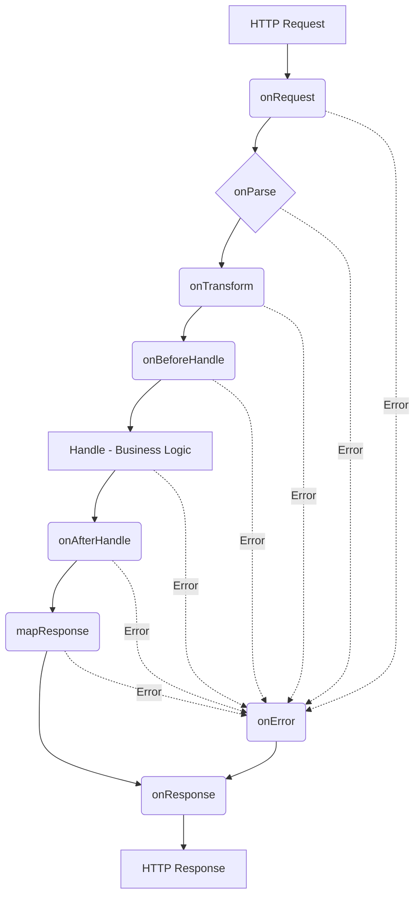

```mermaid
graph TD
    A[HTTP Request] --> B(onRequest)
    B --> C{onParse}
    C --> D(onTransform)
    D --> E(onBeforeHandle)
    E --> F[Handle - Business Logic]
    F --> G(onAfterHandle)
    G --> H(mapResponse)
    H --> I(onResponse)
    I --> J[HTTP Response]

    %% Error Handling Flow
    B -. Error .-> K(onError)
    C -. Error .-> K
    D -. Error .-> K
    E -. Error .-> K
    F -. Error .-> K
    G -. Error .-> K
    H -. Error .-> K
    K --> I
```