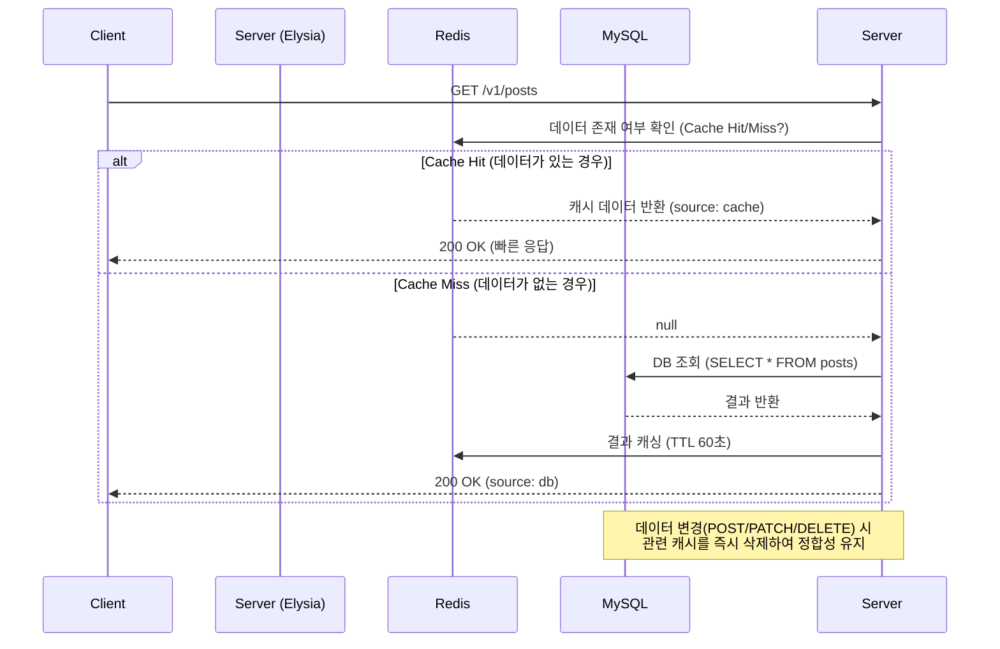

# Redis 캐싱 도입 성능 최적화 결과 보고

게시글 목록 조회(`/v1/posts`)의 성능을 향상시키기 위해 Redis 캐싱을 도입하고 그 결과를 검증했습니다.

## 🚀 통합 성능 측정 결과 (autocannon 비교)

가장 부하가 큰 DB 조회부터 완전 메모리 응답까지의 단계별 성능 수치입니다.

| 테스트 항목 | 요청 속도 (Req/Sec) | 평균 지연 시간 (Latency) | 상태 | 비고 |
|---|---|---|---|---|
| **MySQL 직접 조회** | **~2,914 req/s** | 2.92 ms | 🟢 200 OK | 가장 느림 (디스크 I/O 발생) |
| **404 에러 처리** | **~12,899 req/s** | 0.31 ms | 🔴 404 Error | 라우팅 오버헤드 확인용 |
| **Redis 캐싱 적용** | **~9,400 req/s** | **~1.06 ms** | 🔵 Cache Hit | **DB 대비 3.2배 성능 향상** |
| **Health Check** | **~15,957 req/s** | **0.23 ms** | 🟢 200 OK | 완전 메모리 응답 (이론적 최대치) |

> **분석:** Redis 캐싱 도입 후 DB 직접 조회 대비 **약 3.2배의 성능 향상**을 기록했습니다. 이는 완전 메모리 응답인 Health Check 성능의 약 **60% 수준**까지 도달한 수치로, 캐싱 효율이 매우 높음을 시사합니다.

## 🛠️ 구현 핵심 도식 (Cache-Aside 전략)

## 🔍 검증 상세

### 1. 캐시 동작 검증
- **첫 번째 조회**: `{"source": "db", ...}` 반환 및 해당 데이터 Redis 저장 확인.
- **두 번째 조회**: `{"source": "cache", ...}` 반환 확인 (DB 쿼리 없이 약 1ms 내 응답).

### 2. 캐시 무효화 (Invalidation) 검증
- 새 게시글 작성(`POST`) 호출 시 `cache.redis.del('posts:all:*')`가 실행되어 기존 캐시가 정상적으로 삭제됨을 확인했습니다.
- 작성 직후 다시 목록을 조회하면 자동으로 `source: "db"`가 출력되며 최신 데이터가 반영됩니다.

## 📂 참고 문서
- [Redis 설계 원칙](file:///c:/portpolio/ElysiaJS/.agents/guidelines/Redis_Design_Principles.md)
- [API 설계 원칙](file:///c:/portpolio/ElysiaJS/.agents/guidelines/API_Design_Principles.md)
- [RDB 설계 원칙](file:///c:/portpolio/ElysiaJS/.agents/guidelines/RDB_Design_Principles.md)
